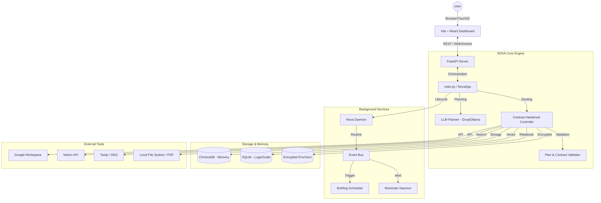

# NOVA - Full Capabilities & Technical Architecture

## Overview

**NOVA (Autonomous Productivity Operator)** is a production-grade, contract-hardened AI assistant designed for reliability, safety, and seamless multi-step execution. It combines a powerful LLM-based planning engine with a robust set of local and cloud integrations to serve as an autonomous productivity layer.

**Core Mission:** To execute complex productivity tasks with zero-hallucination guarantees and high operational safety.

---

## 1. Full Capabilities Catalog

### 🧠 Core Intelligence & Reasoning
- **LLM-Based Planning**: Uses large language models (Groq-fast or local Ollama) to decompose natural language commands into structured execution plans.
- **Contract-Hardened Execution**: Every plan is validated against strict "Action Contracts" (domain/action whitelists) before execution to prevent unsafe operations.
- **Gibberish Filtering**: Rejects invalid or malicious inputs in <1ms before they ever reach the LLM planner.
- **Context-Aware Parsing**: Handles vague temporal commands (e.g., "next week", "later", "tomorrow afternoon") using a specialized natural language date parser.
- **Clarity Engine**: Automatically detects when a user command is too ambiguous and asks for specific clarifications before proceeding.

### 🤖 Autonomous Operations (The Daemon)
- **Background Daemon**: A persistent background process that monitors events, manages reminders, and executes scheduled tasks.
- **Automated Morning Briefings**: Synthesizes data from Calendar, Notion, and Weather to provide a "Mission Briefing" every morning.
- **Reminder Loop**: Proactively alerts the user of upcoming deadlines and overdue tasks via the dashboard and system notifications.
- **System Resource Monitoring**: Tracks CPU, memory, and disk usage, providing real-time telemetry to the dashboard.

### 🔗 Connectivity & Integrations
- **Google Workspace**:
    - **Calendar**: Complete event creation, reading, and management.
    - **Gmail**: Inbox summarization, checking unread threads, and sending authenticated emails.
- **Notion**: Task management, tracking project progress, and updating database entries.
- **Web Intelligence**: Multi-tiered web searches using **Tavily** (primary) and **DuckDuckGo** (fallback) for real-time geopolitical or technical briefing synthesis.
- **Document Processing**:
    - **PDF**: Text extraction and intelligent summarization of local files.
    - **Local Storage**: Secure management of user data and logs.
- **Browser Automation**: Integrated browser engine (Playwright/Selenium) for web interaction and data scraping.

### 💾 Memory System
- **Semantic Vector Storage**: Uses **ChromaDB** with sentence-transformer embeddings to store and retrieve memories based on meaning (e.g., "What do I remember about the deployment?").
- **Keyword Fallback**: Ensures reliability by falling back to keyword-based search if semantic search yields no results.
- **Duplicate Detection**: Intelligent hashing to prevent redundant memory storage.

### 🛡️ Security & Safety
- **Biometric Authentication**: macOS TouchID integration for high-risk operations and dashboard access.
- **Action Guardrails**: Daily mutation limits (e.g., max 3 creates, 5 updates) to prevent runaway processes.
- **Security Officer**: Background service that monitors system integrity and reports on security metrics.
- **Data Encryption**: Transparent encryption for sensitive credentials and local storage.

### 📊 User Interface (NOVA Dashboard)
- **Mission Status (HQ)**: Central viewing area for current system health and mission objectives.
- **Intelligence Comms**: Unified view for emails and web-search synthesis.
- **Security Panel**: Real-time view of security logs and biometric status.
- **Reasoning View**: Peek into the "thought process" and plan decomposition for complex commands.
- **Integrated Terminal**: Direct shell access with NOVA-augmented capabilities.

---

## 2. Technical Architecture

### System Architecture Diagram

### Command Execution Flow
1.  **Ingestion**: Command received via CLI or Dashboard API.
2.  **Safety Check**: Gibberish filter and blocked phrase scanner (pre-filter).
3.  **Planning**: LLM generates a JSON-structured execution plan (Intent -> Domain -> Action -> Params).
4.  **Validation**: `Validator` checks plan against `ALLOWED_ACTIONS` and JSON schema.
5.  **Correction**: If invalid, the LLM attempts to self-correct the plan (up to 2 times).
6.  **Contract Hardening**: Post-validation check ensures the final action is whitelisted and the tool method exists.
7.  **Execution**: The `Controller` routes the action to the specific `Tool` (Calendar, Notion, etc.).
8.  **Telemetry**: Execution results, mutation counts, and performance metrics are logged to SQLite and published to the Event Bus.

### Data Layer Schema (Core)
-   **`goals`**: Tracks long-term user objectives and status.
-   **`events`**: High-performance JSON-based event store for the system timeline.
-   **`auth_sessions`**: Manages biometric and password-based session liveness.
-   **`memories`** (ChromaDB): High-dimensional vectors for semantic retrieval.

### Boot Sequence
1.  **Database**: Verify SQLite schemas and connectivity.
2.  **Security**: Initialize encryption keys and Biometric Auth manager.
3.  **Communication**: Start the `Event Bus`.
4.  **Core**: Initialize `NovaApp` (loads all tools and memory engines).
5.  **Interface**: Start the `API Server` and `Voice Interface`.
6.  **Background**: Launch the `Daemon` threads (Reminders, Monitoring, Schedulers).
