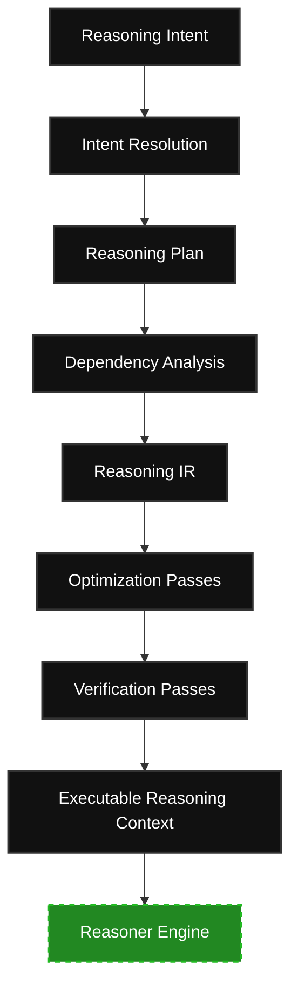

# NAS-011: Reasoning Compiler

**Status:** Locked  
**Version:** 1.0  
**Depends on:** [NAS-001: Theory of Organizational Knowledge](file:///Users/sohamdhande/Docs_Local/NOVA/nova-docs/NAS/Volume-I-Foundations/NAS-001-Theory-of-Organizational-Knowledge.md)  
**Depends on:** [NAS-002: NOVA Semantic Type System (NSTS)](file:///Users/sohamdhande/Docs_Local/NOVA/nova-docs/NAS/Volume-I-Foundations/NAS-002-Semantic-Type-System.md)  
**Depends on:** [NAS-003: Core Semantic Ontology (CSO)](file:///Users/sohamdhande/Docs_Local/NOVA/nova-docs/NAS/Volume-I-Foundations/NAS-003-Core-Ontology.md)  
**Depends on:** [NAS-004: Identity Architecture](file:///Users/sohamdhande/Docs_Local/NOVA/nova-docs/NAS/Volume-I-Foundations/NAS-004-Identity-Model.md)  
**Depends on:** [NAS-005: Temporal Architecture](file:///Users/sohamdhande/Docs_Local/NOVA/nova-docs/NAS/Volume-I-Foundations/NAS-005-Temporal-Model.md)  
**Depends on:** [NAS-006: Provenance Architecture](file:///Users/sohamdhande/Docs_Local/NOVA/nova-docs/NAS/Volume-I-Foundations/NAS-006-Provenance-Model.md)  
**Depends on:** [NAS-007: Knowledge Compiler](file:///Users/sohamdhande/Docs_Local/NOVA/nova-docs/NAS/Volume-II-Compiler/NAS-007-Knowledge-Compiler.md)  
**Depends on:** [NAS-008: Knowledge Intermediate Representation (KIR)](file:///Users/sohamdhande/Docs_Local/NOVA/nova-docs/NAS/Volume-II-Compiler/NAS-008-Knowledge-Intermediate-Representation.md)  
**Depends on:** [NAS-009: Compiler Pass Architecture](file:///Users/sohamdhande/Docs_Local/NOVA/nova-docs/NAS/Volume-II-Compiler/NAS-009-Compiler-Passes.md)  
**Depends on:** [NAS-010: Knowledge Runtime](file:///Users/sohamdhande/Docs_Local/NOVA/nova-docs/NAS/Volume-III-Runtime/NAS-010-Knowledge-Runtime.md)  

---

## 1. Purpose
The Reasoning Compiler transforms executable organizational knowledge into an executable reasoning context. It compiles the minimal, semantically complete, provenance-complete, and temporally consistent knowledge required to satisfy a reasoning intent. Crucially, the Reasoning Compiler never performs reasoning itself; it only prepares the context for downstream reasoning engines.

---

## 2. Scope
This specification defines:
* The core Reasoning Compiler architecture and compilation stages.
* Intent resolution and the generation of typed Intent Records.
* The structure, goals, and lowering of the logical Reasoning Plan.
* The syntax, nodes, and immutability of the Reasoning Intermediate Representation (RIR).
* Deterministic semantic closure calculations (Goal, Provenance, Temporal, Identity, Causal, and Policy).
* Semantic context optimization passes and token/capacity budgets.
* Context verification checks validating semantic, identity, and policy correctness.
* The structure of the Exclusion Model for tracing missing context.
* Budget management tiering.
* The triggers and region boundaries of incremental context recompilation.
* Interaction boundaries with the Knowledge Runtime.

This specification intentionally excludes:
* Large Language Models (LLMs), prompt engineering, or prompt templates.
* Reasoning algorithms, search, planning, or inference execution.
* Storage engines, vector databases, or direct retrieval mechanisms.

---

## 3. Definitions
* **Reasoning Intent**: A declaration of a reasoning objective, target entities, temporal bounds, and budget constraints.
* **Intent Record**: A structured, typed compiler record containing a goal statement, entity bindings, temporal scope parameters, permissions, policies, and execution budgets.
* **Reasoning Plan**: A logical execution plan detailing semantic objectives, required domains, policy bounds, and completion criteria.
* **Reasoning Intermediate Representation (RIR)**: The immutable, canonical graph-based representation of a reasoning program's preparation logic.
* **Executable Reasoning Context**: The deterministic, minimal, provenance-complete, and policy-compliant serialization emitted by the compiler for consumption by reasoning engines.
* **Semantic Closure**: The complete slice of interrelated knowledge necessary to satisfy a reasoning query, computed along dependency pathways.
* **Exclusion Record**: A structured record detailing why a specific semantic object was omitted from the compiled context.

---

## 4. Design Goals
The Reasoning Compiler is designed to satisfy the following goals:
* **Deterministic Context Compilation**: The compilation pipeline must produce identical context outputs for identical runtime inputs and intent records.
* **Semantic Completeness & Minimality**: Emitted contexts must include all necessary dependencies to evaluate the goal while remaining strictly minimal.
* **Provenance & Temporal Integrity**: Causal histories and temporal timelines must be preserved and aligned.
* **Identity Consistency & Policy Compliance**: Contexts must resolve references to canonical identities and enforce organizational access restrictions.
* **Incremental Recompilation**: Subsequent queries recompile only the delta of changed runtime projections or intent structures.
* **Runtime Independence**: The compiled output format is independent of any specific AI reasoning model or storage implementation.

---

## 5. Architecture
The Reasoning Compiler translates a Reasoning Intent into an Executable Reasoning Context using a structured compilation pipeline:

### Compilation Pipeline Stages
1. **Intent Resolution**: Resolves target goals, policies, and budgets into a typed Intent Record without performing retrieval.
2. **Plan Generation**: Lowers the Intent Record into a logical Reasoning Plan declaring objectives and semantic scopes.
3. **Dependency Analysis**: Walks the Knowledge Runtime projections to compute deterministic semantic closures.
4. **RIR Generation**: Emits an immutable, directed graph of compilation concepts.
5. **Context Optimization**: Runs passes to prune dead assertions, normalize time bounds, and compress evidence within the defined budget.
6. **Context Verification**: Assures that the optimized graph complies with all safety, temporal, identity, and policy invariants.
7. **Context Emission**: Emits the validated context as an ephemeral, read-only package for the target reasoner.

---

## 6. Components

### 6.1 Intent Resolution & Records
Intent Resolution converts unstructured reasoning prompts or structured API goals into a typed Intent Record containing:
* **Goal**: The target logical proposition.
* **Entities**: Target semantic symbols.
* **Temporal Scope**: The valid time interval.
* **Permissions**: Access control attributes.
* **Organizational Policies**: Governance mandates.
* **Execution Budget**: Token or node size limitations.
No knowledge retrieval is performed in this phase.

### 6.2 Reasoning Plan
The logical Reasoning Plan bridges the Intent Record and the dependency analyzer. It defines:
* Logical reasoning objectives.
* Required semantic domains.
* Root nodes for dependency traversal.
* Policy constraints and optimization targets.
* Satisfiability and completion criteria.

### 6.3 Dependency Analysis
Dependency Analysis computes the semantic closure of the target query by walking relational runtime pathways. Traversed closures include:
* **Goal Closure**: All dependencies required to address the primary objective.
* **Provenance Closure**: The causal history and verification metadata.
* **Temporal Closure**: Temporal ranges matching the defined temporal scope.
* **Identity Closure**: Coreferences mapping back to canonical identities.
* **Causal Closure**: Chain-of-custody and dependency flows.
* **Policy Closure**: Relevant organizational rule boundaries.

### 6.4 Reasoning Intermediate Representation (RIR)
RIR represents preparation computation as an immutable graph structure. Node types include:
* **Goal Nodes**: Core compilation targets.
* **Fact Nodes**: Validated assertions from the runtime.
* **Entity Nodes**: Conceptual or physical entities.
* **Evidence Nodes**: Source artifacts and verification records.
* **Policy Nodes**: Access boundary parameters.
* **Exclusion Nodes**: Stubs representing removed or blocked objects.
* **Dependency Edges**: Directed lines representing logical dependency requirements.

### 6.5 Optimization Passes
Optimization passes reduce the RIR graph size while maintaining semantic correctness:
* **Dead Knowledge Elimination**: Removes unreferenced facts or dead branches.
* **Semantic Deduplication**: Consolidates duplicate logical nodes.
* **Provenance Compression**: Prunes intermediate provenance chains.
* **Temporal Normalization**: Aligns overlapping temporal bounds.
* **Identity Consolidation**: Combines aliases into canonical nodes.
* **Budget-aware Dependency Pruning**: Prunes lower-tier nodes when context limits are reached.

### 6.6 Verification
Before emission, the optimized RIR is executed against a strict verifier suite:
* **Semantic Completeness**: All required logical inputs must be satisfied.
* **Provenance Completeness**: Evidentiary chains must be continuous.
* **Temporal Consistency**: Time intervals must not contradict.
* **Identity Consistency**: Every reference must bind to a canonical identity.
* **Policy Compliance**: Unauthorized information must be excluded.
* **Dependency Completeness**: No hanging references or unresolved edges.

### 6.7 Exclusion Model
Every excluded node is documented. Each Exclusion Node lists:
* The excluded semantic object.
* The reason for exclusion (e.g., policy prune, budget constraint).
* The originating dependency path.
* Legal, policy, or temporal justifications.

### 6.8 Budget Management
Context is partitioned into four priority tiers:
* **Tier 1 (Critical)**: Goals, required semantic dependencies, policies, identity bindings.
* **Tier 2 (High)**: Primary evidence, temporal anchors.
* **Tier 3 (Medium)**: Supporting context, secondary evidence.
* **Tier 4 (Low)**: Auxiliary explanations.
*Invariant*: Optimization passes may never prune Tier 1 dependencies.

### 6.9 Incremental Recompilation
The compiler monitors runtime projections. It triggers incremental compilation of affected graph regions upon changes to:
* Reasoning intent.
* Runtime knowledge or activated Knowledge Commits.
* Identity bindings.
* Temporal bounds.
* Organizational policies.

### 6.10 Runtime Interaction
The compiler interfaces with the Knowledge Runtime, consuming commits, projections, and state models. It never performs direct disk storage or database reads.

---

## 7. Invariants

### 7.1 Compiler Invariants
* All context is compiled, never retrieved.
* Context generation is deterministic.
* Compiled context is ephemeral and is never stored.
* Every inclusion and exclusion must be explainable.
* Context verification is mandatory and must precede emission.

### 7.2 Architectural Invariants
* The compiler never performs reasoning.
* The runtime never assembles context.
* Executable Reasoning Context is model-agnostic.
* Retrieval may only be used as an internal compiler optimization.

---

## 8. Non-Goals
This specification does not define:
* Specific LLM model behaviors or APIs.
* Vector search, indexing, or retrieval algorithms.
* Prompt layouts, prompt engineering, or prompt templates.
* Agent planning, inference, or orchestrator models.

---

## 9. Future Extensions
* Cross-model context translation adapters.
* RIR subgraph caching systems.
* Federated context compilation across multiple runtimes.

---

## 10. References
* [NAS-001: Theory of Organizational Knowledge](file:///Users/sohamdhande/Docs_Local/NOVA/nova-docs/NAS/Volume-I-Foundations/NAS-001-Theory-of-Organizational-Knowledge.md)
* [NAS-002: Semantic Type System](file:///Users/sohamdhande/Docs_Local/NOVA/nova-docs/NAS/Volume-I-Foundations/NAS-002-Semantic-Type-System.md)
* [NAS-003: Core Ontology](file:///Users/sohamdhande/Docs_Local/NOVA/nova-docs/NAS/Volume-I-Foundations/NAS-003-Core-Ontology.md)
* [NAS-004: Identity Architecture](file:///Users/sohamdhande/Docs_Local/NOVA/nova-docs/NAS/Volume-I-Foundations/NAS-004-Identity-Model.md)
* [NAS-005: Temporal Architecture](file:///Users/sohamdhande/Docs_Local/NOVA/nova-docs/NAS/Volume-I-Foundations/NAS-005-Temporal-Model.md)
* [NAS-006: Provenance Architecture](file:///Users/sohamdhande/Docs_Local/NOVA/nova-docs/NAS/Volume-I-Foundations/NAS-006-Provenance-Model.md)
* [NAS-007: Knowledge Compiler](file:///Users/sohamdhande/Docs_Local/NOVA/nova-docs/NAS/Volume-II-Compiler/NAS-007-Knowledge-Compiler.md)
* [NAS-008: Knowledge Intermediate Representation (KIR)](file:///Users/sohamdhande/Docs_Local/NOVA/nova-docs/NAS/Volume-II-Compiler/NAS-008-Knowledge-Intermediate-Representation.md)
* [NAS-009: Compiler Passes](file:///Users/sohamdhande/Docs_Local/NOVA/nova-docs/NAS/Volume-II-Compiler/NAS-009-Compiler-Passes.md)
* [NAS-010: Knowledge Runtime](file:///Users/sohamdhande/Docs_Local/NOVA/nova-docs/NAS/Volume-III-Runtime/NAS-010-Knowledge-Runtime.md)
